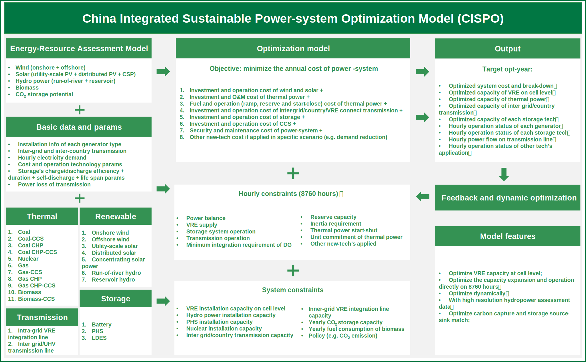
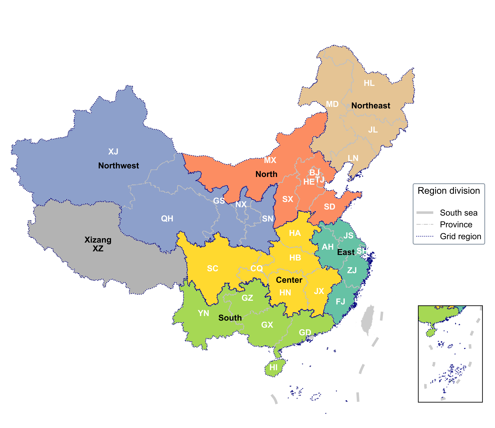

The CISPO model is a long-term power-system planning model for China.

<!--more-->

The China Integrated Sustainable Power-system Optimization Model (CISPO) is designed to simulate the dynamic changes and hourly operations within China's power systems resulting from novel investments in power generation, storage, and transmission spanning the target period (e.g., from 2030--2060) within a given optimization step (e.g., 10 years). Within each planning year interval, CISPO optimizes the least-cost portfolio, considering input assumptions related to future electric demand, investment costs, technology performance parameters, planning and operating reserves, inertia requirements, and energy availability factors including installation capacity potential and hourly generation profiles. The technologies incorporated into the CISPO model encompass variable renewable energies (VREs), including onshore and offshore wind, utility-scale and distributed solar photovoltaic (PV), concentrating solar power (CSP), hydropower, thermal power (coal, natural gas, and biomass energy), nuclear power, battery storage, pumped hydro storage (PHS), and both intra-grid and inter-grid transmission (alternating current (AC) and direct current (DC)). The data exchange across planning years encompasses the installed and retired capacity of generation.

In this model, we optimize various parameters at the provincial level, including power balance, electric flow, energy storage deployment, dispatch route, and unit commitment of thermal and nuclear power, while also addressing grid safety requirements (inertia and reserve requirements). The model encompasses a total of 32 provinces, with Inner Mongolia divided into two regions, namely Mengdong and Mengxi, due to their different grid region connecting. Throughout the model formulation section, these provinces are denoted as the power grid, refer to Table \ref{tab:reg_div} and Figure \ref{fig:reg_div} for an overview of the regional division and their corresponding designations. VREs are optimized at the cell level (0.25°$\times$0.25°, approximately 25$\times$25 km at middle altitude in this study) for both capacity expansion and power dispatch. Additionally, these for hydropower are considered at the dam site level. 

