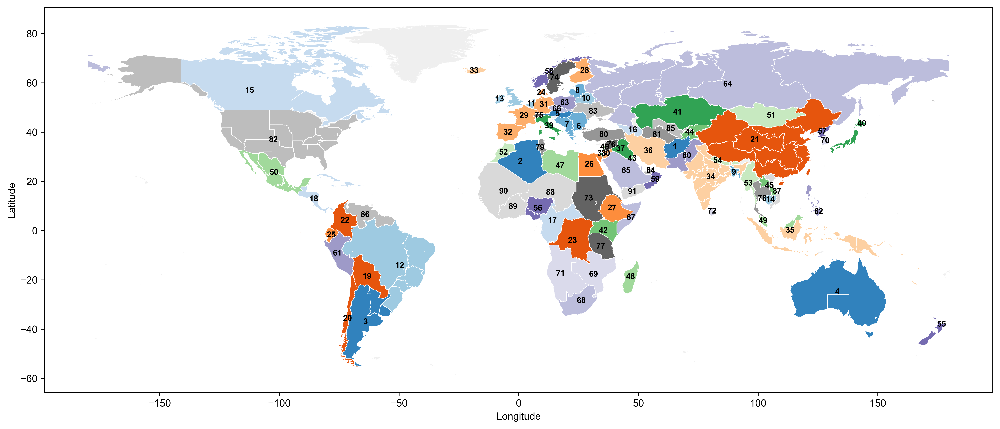

The GISPO model is a long-term power-system planning model for the whole world.

<!--more-->
# Introduction
The Global Integrated Sustainable Power-system Optimization Model (CISPO) is designed to simulate the dynamic changes and hourly operations for global power systems resulting from novel investments in power generation, storage, and transmission spanning the target period (e.g., from 2030--2060) within a given optimization step (e.g., 10 years). Within each planning year interval, CISPO optimizes the least-cost portfolio, considering input assumptions related to future electric demand, investment costs, technology performance parameters, planning and operating reserves, inertia requirements, and energy availability factors including installation capacity potential and hourly generation profiles. The technologies incorporated into the CISPO model encompass variable renewable energies (VREs), including onshore and offshore wind, utility-scale and distributed solar photovoltaic (PV), concentrating solar power (CSP), hydropower, thermal power (coal, natural gas, and biomass energy), nuclear power, battery storage, pumped hydro storage (PHS), and both intra-grid and inter-grid transmission (alternating current (AC) and direct current (DC)). The data exchange across planning years encompasses the installed and retired capacity of generation.

