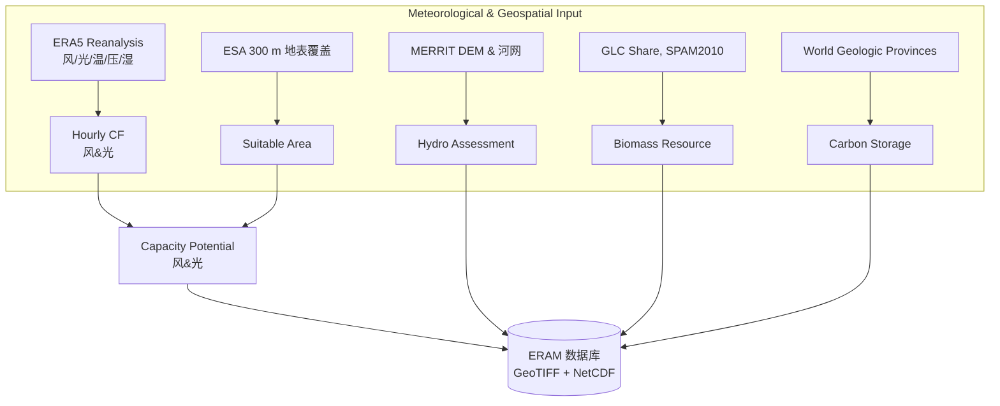
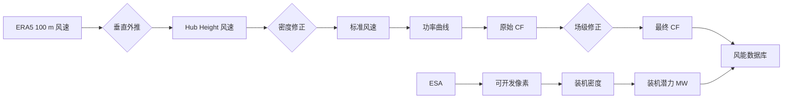
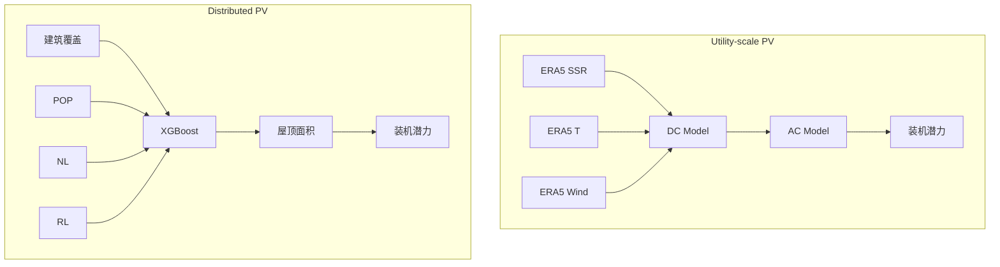

# Energy Resource Assessment Model (ERAM)  
**全球高分辨率可再生能源与碳封存资源评估模型 – 技术白皮书与流程图**

---

## 1. 模型定位与核心价值
| 维度 | 内容 |
|---|---|
| **愿景** | 为 1.5 °C / 2 °C 路径下的全球电力系统优化与政策决策，提供时空高分辨率、技术-环境-社会约束耦合的资源潜力数据集 |
| **空间分辨率** | 0.25°×0.25°（≈ 25 km×25 km 赤道处），与 ERA5 气象网格一致 |
| **时间分辨率** | 逐小时，1940-至今 |
| **评估对象** | • 风能（陆上 / 离岸）<br>• 太阳能（集中式 / 分布式屋顶）<br>• 水能（常规 & 抽水蓄能）<br>• 生物质能（农、林、草残余）<br>• 碳封存（深层咸水层 CCS & BECCS） |
| **输出指标** | 装机容量潜力 (MW)、年/小时级容量因子 (CF)、年发电量 (GWh)、碳封存潜力 (Gt CO₂) |

---

## 2. 总体技术框架


---

## 3. 核心模块拆解

### 3.1 风能资源（Wind Power）
| 步骤 | 关键公式 / 数据 | 备注 |
|---|---|---|
| ① 风速外推 | $v_{hub}=v_{100}(\frac{z_{hub}}{100})^{\alpha}$ | α 由 10 m & 100 m 风速回归 |
| ② 密度修正 | $v_{std}=v_{meas}(\frac{\rho_{meas}}{\rho_{std}})^{-1/3}$ | ρ 通过理想气体方程求取 |
| ③ 功率曲线 | 分段函数 + 三次多项式拟合 | NREL 2020 ATB 5.5 MW 陆上 / IEA 15 MW 海上 |
| ④ 场级损失 | CF × 0.95（尾流 & 电气）<br>低温停机 (-30 °C)<br>重启滞后 (20 m/s) | GISPO 特有修正 |
| ⑤ 可开发面积 | 0.25° 网格内 300 m 像素级排除：保护区、坡度、海拔、航道 | 保守 / 基准 / 开放三情景 |
| ⑥ 装机密度 | Onshore 4 MW/km² (7D×7D)<br>Offshore 5 MW/km² | NREL 转子直径约束 |

**风能流程图**  


---

### 3.2 太阳能资源（Solar PV）
| 步骤 | 关键公式 / 数据 | 备注 |
|---|---|---|
| ① 直流输出 | $\frac{P_{dc}}{P_{dc0}}=[1+\gamma(T_{cell}-T_{std})]\frac{SSR}{SSR_{std}}\eta_{sys}$ | γ = -0.005 °C⁻¹ |
| ② 温度模型 | $T_{cell}=4.3+0.943T_{air}+0.028G-1.528v_{wind}$ | Sandia 经验系数 |
| ③ 逆变器模型 | η = f(ζ) PVWatts 曲线 | η_nom = 0.96 |
| ④ 倾角 & 间距 | Σ(φ) 经验公式<br>$D=L(\cos\Sigma+\sin\Sigma/\tan\beta_n\cos\phi_s)$ | 避免遮挡 |
| ⑤ 分布式屋顶 | • 训练 XGBoost 预测屋顶面积 (BA+POP+NL+RL)<br>• 30/35/40 % 屋顶可利用率 | R² = 0.885 |

**光伏流程图**  


---

### 3.3 水能 & 抽水蓄能
| 模块 | 方法 | 约束 |
|---|---|---|
| **常规水电** | • MERIT 河网 + 4.5 km 虚拟坝<br>• 10-300 m 高度遍历 → 淹没模拟<br>• LCOE ≤ 0.25 $/kWh | 保护区、人口 >50k、电网距离 |
| **抽水蓄能** | • Stocks et al. 616k 闭式库址<br>• 100 MW 步长，4-18h 储能时长<br>• LCOS ≤ 0.05 $/kWh | 排除保护区、城市、雨林、重叠水库 |

---

### 3.4 生物质能
| 来源 | 公式 | 关键参数 |
|---|---|---|
| **农业残余** | $R_i^a=\xi_i\cdot LHV_i\cdot RPR(y_i)\cdot p_i$ | 14 种作物，ξ=0.85，72.8 EJ/yr |
| **林业/草** | $R_i^f=\xi_i\cdot LHV_i\cdot B_i(1-C-L)$ | ξ_forest=0.5, ξ_grass=0.2<br>132 EJ/yr + 9 EJ/yr |

---

### 3.5 碳封存
| 存储介质 | 公式 | 关键参数 |
|---|---|---|
| **深层咸水层** | $V_{CO_2}=A\eta_A h\phi\rho_{CO_2}\eta_E$ | η_A=0.025, h=250 m, ϕ=0.2, η_E=0.05<br>全球 ≈ 3676 Gt |

---

## 4. 情景与不确定性框架
| 情景 | 土地可用性 | 航道阈值 | 屋顶可用率 |
|---|---|---|---|
| **Open** | 最宽松 | 90% 分位 | 40 % |
| **Base** | 中位 | 85% 分位 | 35 % |
| **Conservative** | 最严格 | 80% 分位 | 30 % |

---

## 5. 输出数据格式与可视化
| 文件名示例 | 内容 | 格式 |
|---|---|---|
| `cf_wind_onshore_2019_0p25.nc` | 逐小时陆上风电 CF | NetCDF |
| `cap_solar_distributed_base.tif` | 分布式光伏装机潜力 | GeoTIFF |
| `hydro_lcoe_dam_site.csv` | 坝址级 LCOE | CSV |
| `biomass_agri_spam2010.tif` | 农业残余能量密度 | GeoTIFF |
| `ccs_dsa_potential.tif` | 咸水层封存潜力 | GeoTIFF |

---

## 6. 如何引用
```bibtex
@misc{ERAM2024,
  title={Global Energy Resource Assessment Model (ERAM)},
  author={GISPO Group},
  year={2024},
  url={https://github.com/GISPO/ERAM}
}
```

---

## 7. 联系与贡献
- 技术问题：mrziheng@outlook.com

> “用高分辨率的事实，支撑全球零碳未来。”