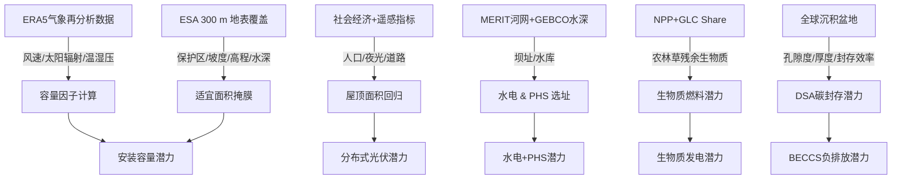

# 📘 Energy Resource Assessment Model（ERAM）技术文档  
*版本：v2025.07*  
*语言：中文 | 最后更新：2025-07-14*

---

## 1. 模型定位
**ERAM** 是一套面向全球尺度、高分辨率、小时级时间粒度的可再生能源与储能资源评估框架，覆盖风、光、水、生物质、抽水蓄能与碳封存六大技术路线，为长期能源规划、投资组合优化及气候政策制定提供数据底座。

---

## 2. 技术路线与模块划分

| 模块 | 技术 | 空间分辨率 | 时间分辨率 | 输出量纲 |
|---|---|---|---|---|
| S2.1 | 风电 | 0.25°×0.25° | 1 h | CF、MW、GWh |
|  | 光伏（集中+分布式） | 0.25°×0.25° | 1 h | CF、MW、GWh |
| S2.2 | 水电 & 抽水蓄能 | dam-site | 年 | MW、GWh、LCOS |
| S2.3 | 生物质 | 0.0833°/1 km | 年 | EJ、MW |
| S2.4 | 地质封存（BECCS-DSA） | 沉积盆地 | 年 | Gt CO₂ |

---

## 3. 方法论总览



---

## 4. 核心算法拆解

### 4.1 风电
#### 4.1.1 小时容量因子
- **输入**  
  - ERA5：U100m, V100m, T2m, RH2m, sp  
- **步骤**  
  1. 垂直风切变外推：$ v_{120/150}=v_{100}\cdot(z/z_{100})^\alpha $  
  2. 标准密度修正：$ v_{\text{std}}=v_{\text{meas}}\cdot(\rho_{\text{meas}}/1.225)^{-1/3} $  
  3. 功率曲线分段映射（>25 m/s 切出；<−30 °C 停机；5% 损失）。  
- **机型**  
  - 陆上：NREL 5.5 MW-175 m  
  - 海上：IEA 15 MW-240 m  

#### 4.1.2 适宜面积 & 安装密度
- **掩膜规则**  
  - 保护区、坡度(>15 %)、高海拔(>3000 m)、水深(>40–100 m)、航运密度  
- **情景**  
  - Open / Base / Conservative（见表 S3-S4）  
- **密度**  
  - 陆上：4 MW/km²（7×7转子直径）  
  - 海上：5 MW/km²  

---

### 4.2 光伏
#### 4.2.1 小时容量因子
- **模型**：固定倾角 + PVWatts  
- **公式**  
  - DC：$ \frac{P_{\text{dc}}}{P_{\text{dc}0}}=[1+\gamma(T_{\text{cell}}-25)]\frac{SSR}{1000}\eta_{\text{sys}} $  
  - AC：$ \frac{P_{\text{ac}}}{P_{\text{ac}0}}=\min\left(\eta(\zeta)\cdot\frac{P_{\text{dc}}}{P_{\text{ac}0}},1\right),\quad\zeta=\frac{P_{\text{dc}}}{P_{\text{dc}0}} $  
  - 逆变器效率曲线：$ \eta(\zeta)=\frac{0.96}{0.9637}(-0.0162\zeta^2+0.9858\zeta-0.0059) $  
- **环境修正**：温度 & 风速对 $T_{\text{cell}}$ 的耦合模型。

#### 4.2.2 适宜面积
- **集中式**：同风电的掩膜逻辑 + 土地利用类型系数  
- **分布式**：  
  1. 0.125°×0.125° fishnet  
  2. XGBoost 回归：BA + POP + RL + NL → 屋顶面积  
  3. 可安装比例：Open 40 % / Base 35 % / Conservative 30 %  

#### 4.2.3 安装密度
- **倾角**：纬度多项式回归（北半球 R²=0.96，南半球 R²=0.97）  
- **间距**：避免冬至/夏至 15:00 阴影  
- **组件功率**：161.9 W/m²  
- **密度**：$ D_{\text{pv}}=161.9\times\text{PF},\quad \text{PF}=L/D $

---

### 4.3 水电 & 抽水蓄能
- **水电**  
  - 4.5 km 间隔虚拟坝址  
  - 10–300 m 坝高遍历 → 淹没面积 → LCOE ≤ 0.25 $/kWh  
  - 全球未开发潜力 ≈ 1500 GW  
- **抽水蓄能**  
  - 616 000 处闭式循环库址 → 100 MW 步长 → LCOS ≤ 0.05 $/kWh  
  - 排除保护地、城市、争议区、共享库址  
  - 全球潜力 ≈ 10 000 GW（4–18 h 储能时长）

---

### 4.4 生物质
- **农业剩余物**：14 类作物（SPAM2010）→ 72.8 EJ/yr  
  - 公式：$ R_i^a=\xi_i\cdot\text{LHV}_i\cdot\text{RPR}(y_i)\cdot p_i $  
- **林业 & 草**：NASA NPP + GLC Share → 132 EJ/yr（林）、9 EJ/yr（草）  
- **限制**：生态还田 30 %、物理损耗 5 %

---

### 4.5 碳封存（BECCS-DSA）
- **潜在容量**：  
  $$ V_{\text{CO}_2}=A\cdot\eta_A\cdot h\cdot\phi\cdot\rho_{\text{CO}_2}\cdot\eta_E $$  
  - 参数：η_A=2.5 %、h=250 m、φ=20 %、ρ=710 kg/m³、η_E=5 %  
- **结果**：全球 3 676 Gt CO₂，分布见图 S24。

---

## 5. 数据与工具链

| 数据类别 | 数据集 | 分辨率 | 来源 |
|---|---|---|---|
| 气象 | ERA5 | 0.25°×0.25°, 1 h | ECMWF |
| 地形 | MERIT DEM / GEBCO | 90 m / 15 arc-sec | NASA / GEBCO |
| 地表覆盖 | ESA WorldCover 2020 | 300 m | ESA |
| 航运密度 | AIS 2015-2021 | 0.005° | World Bank |
| 人口 | WorldPop 2020 | 100 m | WorldPop |
| 夜光 | VIIRS 2020 | 500 m | NASA/NOAA |
| 道路 | OSM / Microsoft AI | 矢量 | OSM |
| 屋顶 | Microsoft Building Footprints 等 | 矢量 | Microsoft, Shi et al. |
| 农业 | SPAM2010 | 0.0833° | IFPRI |
| NPP | MODIS NPP 2015 | 1 km | NASA |
| 地质 | World Geologic Provinces | 矢量 | USGS |

---

## 6. 输出文件清单（示例）
```
ERAM/
├─ wind/
│  ├─ onshore/
│  │  ├─ CF_hourly_2019.nc      # 小时容量因子
│  │  ├─ suitable_area_base.tif # 适宜面积
│  │  └─ install_cap_open.tif   # 安装容量
│  └─ offshore/...
├─ solar/
│  ├─ utility/
│  │  ├─ CF_hourly_2019.nc
│  │  └─ install_cap_conservative.tif
│  └─ distributed/...
├─ hydro/
│  ├─ potential_sites.shp
│  └─ LCOE.tif
├─ biomass/
│  ├─ agri_residue.tif
│  └─ forestry_grass.tif
└─ CCS/
   └─ DSA_potential.tif
```

---

## 7. 快速使用示例（Python伪代码）

```python
import xarray as xr, rioxarray as rxr

# 1. 读取陆上风电小时容量因子
cf = xr.open_dataarray('wind/onshore/CF_hourly_2019.nc')
# 2. 选取华北地区某格点
cf_bj = cf.sel(lat=39.75, lon=116.25, method='nearest')
# 3. 计算年平均CF
cf_annual = cf_bj.mean().item()   # ≈ 0.28
# 4. 读取安装容量
cap = rxr.open_rasterio('wind/onshore/install_cap_base.tif')
cap_bj = cap.sel(y=39.75, x=116.25, method='nearest').item()  # ≈ 200 MW
# 5. 年发电量
annual_GWh = cf_annual * cap_bj * 8760 / 1000   # ≈ 490 GWh
```

---

## 8. 版本更新日志
| 日期 | 内容 |
|---|---|
| 2025-07-14 | 初版中文技术文档发布 |

---

## 9. 联系与引用
- 模型论文：*Global Energy Resource Assessment Framework for Long-term Decarbonization Planning*  
- 数据门户：https://eram-data.org  
- 技术支持：support@eram-data.org