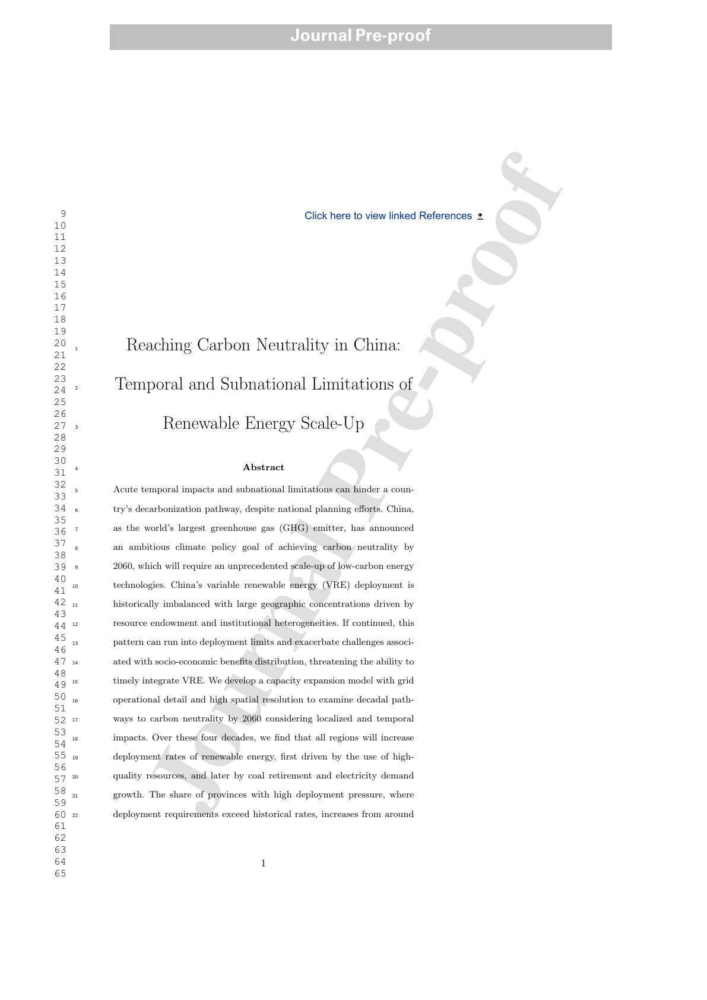

This study connects power-system modeling with political-economy constraints by identifying when and where renewable deployment pressures may become binding in China's transition pathway.

<figure>
  
  <figcaption>Figure 1: Advances in Applied Energy paper.</figcaption>
</figure>
