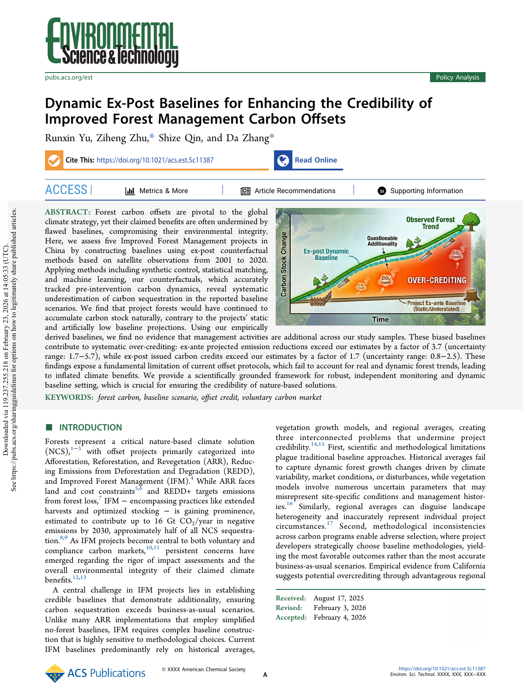

This paper develops dynamic ex-post baselines for improved forest management carbon offset projects by combining satellite observations with causal inference and machine learning methods.

<figure>
  
  <figcaption>Figure 1: ES&T paper.</figcaption>
</figure>
