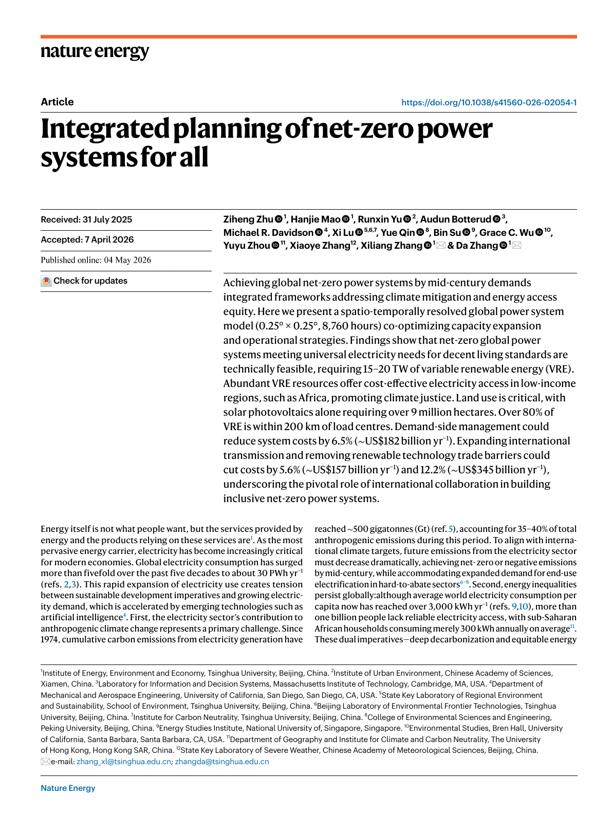

This paper introduces the GISPO framework for global net-zero power-system planning and provides open code, figure-reproduction scripts, renewable resource datasets, and linear-programming instances for reproducible analysis.

<figure>
  
  <figcaption>Figure 1: Nature Energy paper.</figcaption>
</figure>
